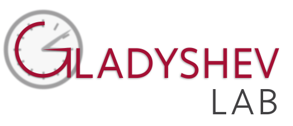

<p align="center">
  
   <br>
</p>


<h1><b>  𝙷𝚒! 𝙸'𝚖 𝙺𝚎𝚓𝚞𝚗 (𝙰𝚕𝚋𝚎𝚛𝚝) 𝚈𝚒𝚗𝚐 -- 应可钧 </b></h1>

<div align="center",>
  <br>
   
   
  
</div>


- I'm a PhD candidate at [Harvard Medical School](https://hms.harvard.edu/), [Vadim Gladyshev lab](https://gladyshevlab.bwh.harvard.edu/)

- My research interests include aging and omics, with a focus on the cause of aging, epigenetics, metabolism, and multi-omics.

- My recent work focuses on [the causal role of DNA methylation in aging and age-related diseases, and I built the first causal biomarker of
aging](https://t.co/yAWcTiPCaV)

- I also built the [ClockBase](https://clockbase.org) ([preprint](https://www.biorxiv.org/content/10.1101/2023.02.28.530532v1)), which provides a
resource for the scientific community to quantify and explore biological ages of more than 300,000 samples on GEO, thus facilitating discovery of
new longevity interventions and age-accelerating conditions.

- I'm also interested in **machine learning** and **protein design**.

<div align="center",>
  <br>
  <a href="https://hms.harvard.edu/">
  
  <a/>
  <a href="https://gladyshevlab.bwh.harvard.edu/">
  
  <a/>
  <a href="https://www.clockbase.org">
  
  <a/>
</div>

<h2><b>  Find me here </b></h2>
    
<div>
<div align="center",>
  <br>
  <a href="https://www.linkedin.com/in/kejun-albert-ying/">
   
  <a/>
  <a href="https://scholar.google.com/citations?user=JS7AdkcAAAAJ&hl=en">
   
  <a/>
  <a href="https://twitter.com/KejunYing">
  
  </a>
</div>

</div>

<h2><b>  Coding Stats </b></h2>

<!--START_SECTION:waka-->


**🐱 My GitHub Data** 

> 📦 6.6 MB Used in GitHub's Storage 
 > 
> 🏆 142 Contributions in the Year 2024
 > 
> 🚫 Not Opted to Hire
 > 
> 📜 42 Public Repositories 
 > 
> 🔑 37 Private Repositories 
 > 
**I'm a Night 🦉** 

```text
🌞 Morning                75 commits          ████░░░░░░░░░░░░░░░░░░░░░   15.00 % 
🌆 Daytime                140 commits         ███████░░░░░░░░░░░░░░░░░░   28.00 % 
🌃 Evening                157 commits         ████████░░░░░░░░░░░░░░░░░   31.40 % 
🌙 Night                  128 commits         ██████░░░░░░░░░░░░░░░░░░░   25.60 % 
```
📅 **I'm Most Productive on Thursday** 

```text
Monday                   41 commits          ██░░░░░░░░░░░░░░░░░░░░░░░   08.20 % 
Tuesday                  77 commits          ████░░░░░░░░░░░░░░░░░░░░░   15.40 % 
Wednesday                68 commits          ███░░░░░░░░░░░░░░░░░░░░░░   13.60 % 
Thursday                 115 commits         ██████░░░░░░░░░░░░░░░░░░░   23.00 % 
Friday                   100 commits         █████░░░░░░░░░░░░░░░░░░░░   20.00 % 
Saturday                 52 commits          ███░░░░░░░░░░░░░░░░░░░░░░   10.40 % 
Sunday                   47 commits          ██░░░░░░░░░░░░░░░░░░░░░░░   09.40 % 
```


📊 **This Week I Spent My Time On** 

```text
🕑︎ Time Zone: America/New_York

💬 Programming Languages: 
Other                    19 hrs 27 mins      ███████████████░░░░░░░░░░   61.26 % 
Python                   11 hrs 49 mins      █████████░░░░░░░░░░░░░░░░   37.21 % 
R                        15 mins             ░░░░░░░░░░░░░░░░░░░░░░░░░   00.80 % 
Vim Script               11 mins             ░░░░░░░░░░░░░░░░░░░░░░░░░   00.60 % 
Markdown                 1 min               ░░░░░░░░░░░░░░░░░░░░░░░░░   00.07 % 

💻 Operating System: 
Mac                      20 hrs 55 mins      ████████████████░░░░░░░░░   65.86 % 
Linux                    10 hrs 50 mins      █████████░░░░░░░░░░░░░░░░   34.14 % 
```

**I Mostly Code in R** 

```text
R                        18 repos            █████████░░░░░░░░░░░░░░░░   36.73 % 
Jupyter Notebook         11 repos            ██████░░░░░░░░░░░░░░░░░░░   22.45 % 
Python                   9 repos             █████░░░░░░░░░░░░░░░░░░░░   18.37 % 
HTML                     3 repos             ██░░░░░░░░░░░░░░░░░░░░░░░   06.12 % 
Shell                    1 repo              █░░░░░░░░░░░░░░░░░░░░░░░░   02.04 % 
```


**Timeline**


 Last Updated on 06/06/2024 18:40:52 UTC
<!--END_SECTION:waka-->


